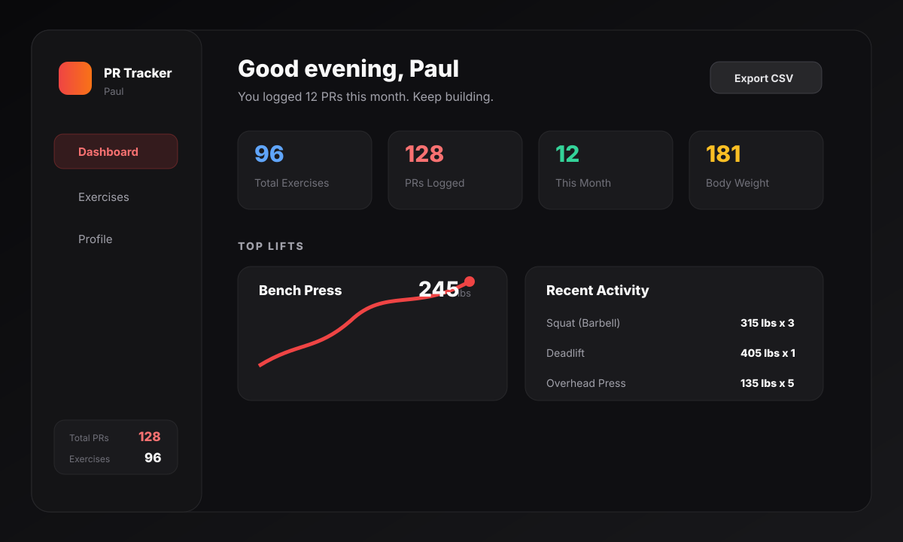
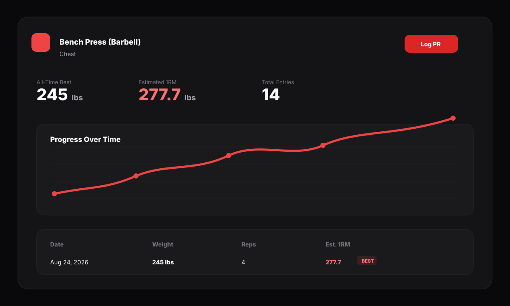

# Nercessian's PR Tracker

[](#)
[](LICENSE)
[](https://github.com/Bouwles/nercessians-pr-tracker/commits)


A dark desktop app for tracking gym personal records, body weight, and training progress. Built with Electron, React, Tailwind CSS, Recharts, and local-first storage.



## What It Does

- Tracks PRs by exercise with date, weight, reps, unit, and notes.
- Estimates 1RM with the Epley formula.
- Shows progress charts for weight and estimated 1RM.
- Highlights recent activity and top lifts on the dashboard.
- Tracks body weight history separately from lift PRs.
- Includes a searchable exercise library with built-in and custom exercises.
- Exports PR history to CSV.
- Stores everything locally with no account and no cloud dependency.



## Best Way To Use It

Download the portable Windows release from the [**Releases page**](https://github.com/Bouwles/nercessians-pr-tracker/releases/latest), extract it if it is provided as a `.zip`, and run `Nercessian's PR Tracker.exe`. You do not need to run `install.bat`, install dependencies, or open a terminal.

If you want to develop the app locally, use the commands below.

## Development Setup

```bash
npm install
npm start
```

## Build A Release

```bash
npm run build
```

Build output goes to `release/` and includes:

- an NSIS installer `.exe`
- a portable Windows `.exe`

## Tech Stack

| Layer | Tech |
| --- | --- |
| Desktop shell | Electron 28 |
| UI | React 18 |
| Styling | Tailwind CSS |
| Charts | Recharts |
| Data persistence | electron-store |
| Bundler | Webpack 5 + Babel |
| Release packaging | electron-builder |

## Data Storage

Data is stored locally by `electron-store` under the app's user-data directory. No workout data leaves your machine unless you export it yourself.

## Troubleshooting

If the development app opens to a blank window, run:

```bash
npm run webpack:build
npm start
```

If packaging fails, delete `release/`, run `npm install`, then run `npm run build` again.

## Made By

Paul Nercessian

## License

MIT — see [LICENSE](LICENSE).
